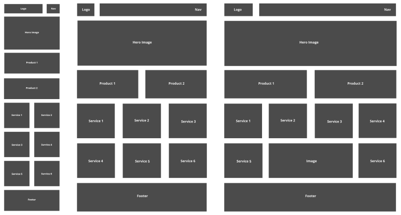

# Nathalia Lima HW #2 - MMED-1056 - Web Development 1
This repo is for Web Development 1 Hw #2 - Practice Scaffold

___

## About the project

This site was created to practice creating mobile-first and responsive websites using best practices and media queries replicating the following image on mobile, tablet and desktop.

___

## Installation

There is no installation required.

## Usage

Open index.html in the browser of your choice.

## Contributing

1. Fork it!
2. Create your feature branch: `git checkout -b my-new-feature`
3. Commit your changesL `git commit -am 'Add some feature'`
4. Push to the branch: `git push origin my-new-feature`
5. Submit a pull request :D

## History

February 05, 2024

## Credits

Nathalia Lima

## License

MIT - please see [license file](LICENSE).
